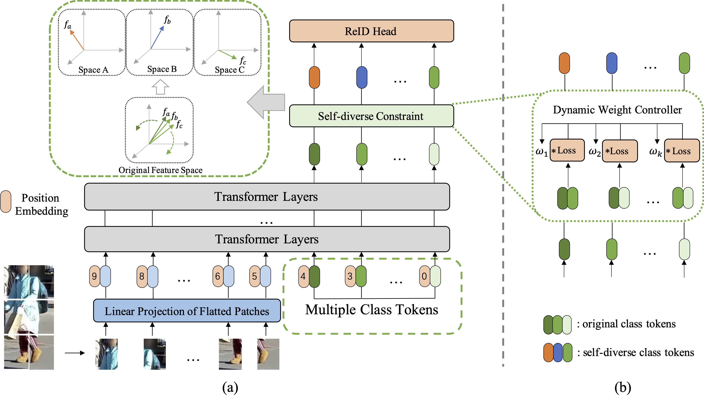
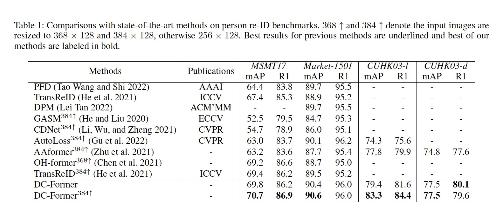

# [AAAI2023] DC-Former: Diverse and Compact Transformer for Person Re-Identification

The repository for  [DC-Former: Diverse and Compact Transformer for Person Re-Identification] achieves state-of-the-art performances on 3 commonly used person re-ID including MSMT17, Market-1501 and CUHK03.


## Overview
In person re-identification (re-ID) task, it is still challenging to learn discriminative representation by deep learning, due to limited data. Generally speaking, the model will get better performance when increasing the amount of data. The addition of similar classes strengthens the ability of the classifier to identify similar identities, thereby improving the discrimination of representation. In this paper, we propose a Diverse and Compact Transformer (DC-Former) that can achieve a similar effect by splitting embedding space into multiple diverse and compact subspaces. Compact embedding subspace helps model learn more robust and discriminative embedding to identify similar classes. And the fusion of these diverse embeddings containing more fine-grained information can further improve the effect of re-ID. Specifically, multiple class tokens are used in vision transformer to represent multiple embedding spaces. Then, a self-diverse constraint (SDC) is applied to these spaces to push them away from each other, which makes each embedding space diverse and compact. Further, a dynamic weight controller (DWC) is further designed for balancing the relative importance among them during training. The experimental results of our method are promising, which surpass previous state-of-the-art methods on several commonly used person re-ID benchmarks. Our code will be publicly available soon.



## Performance




## Training

We utilize 4 GPUs for training.

```bash
CUDA_VISIBLE_DEVICES=0,1,2,3 \
    python -m torch.distributed.launch --nproc_per_node=4 --master_port 66666 train.py --config_file configs/MSMT17/vit_transreid_stride_384.yml \
    MODEL.DIST_TRAIN True \
    INPUT.GS_PROB 1.0 \
    MODEL.JPM False \
    MODEL.PRETRAIN_PATH $PRETRAIN_PATH \
    MODEL.CLS_TOKEN_NUM 2 \
    MODEL.CLS_TOKENS_LOSS True \
    MODEL.DYNAMIC_BALANCER False \
    DATASETS.ROOT_DIR $DATAROOT \
    SOLVER.BASE_LR 0.032 \
    SOLVER.IMS_PER_BATCH 256 \
    SOLVER.MAX_EPOCHS 180 \
    SOLVER.CHECKPOINT_PERIOD 180 \
    SOLVER.EVAL_PERIOD 180 \
    TEST.MEAN_FEAT False \
    OUTPUT_DIR $OUTPUT_DIR
```

## Evaluation

```bash
python test.py --config_file configs/MSMT17/vit_transreid_stride_384.yml \
    INPUT.GS_PROB 1.0 \
    MODEL.DEVICE_ID "('0')" \
    MODEL.JPM False \
    MODEL.PRETRAIN_PATH $PRETRAIN_PATH \
    MODEL.PRETRAIN_CHOICE self \
    MODEL.CLS_TOKEN_NUM 2 \
    MODEL.CLS_TOKENS_LOSS True \
    DATASETS.ROOT_DIR $DATAROOT \
    TEST.MEAN_FEAT False \
    TEST.WEIGHT $CHECKPOINT_PATH \
    OUTPUT_DIR $OUTPUT_DIR
```

## Acknowledgement

Codebase from [TransReID](https://github.com/damo-cv/TransReID)

